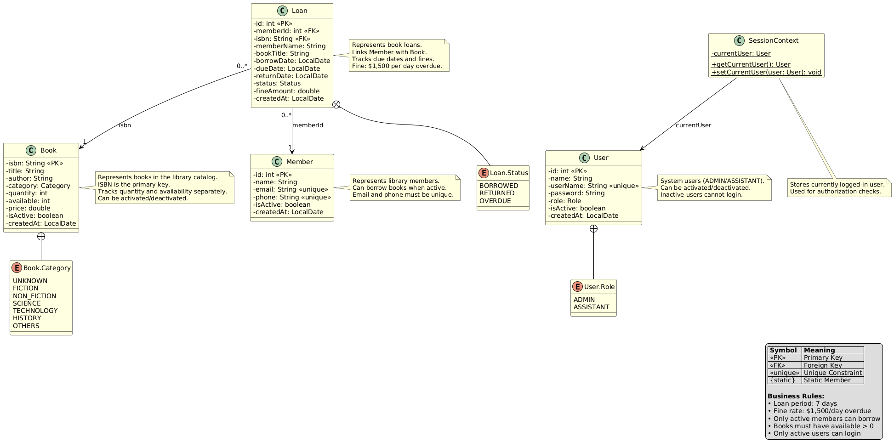
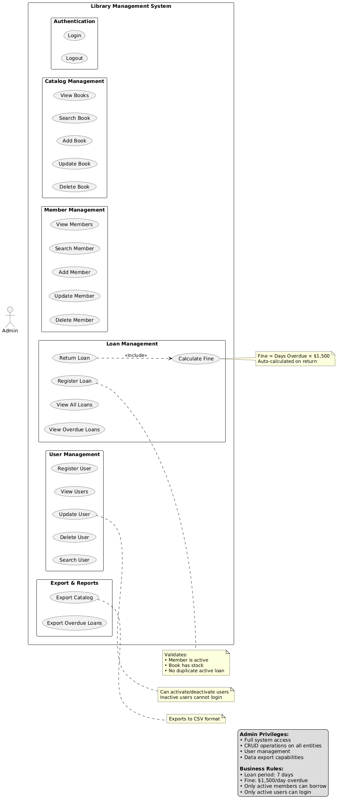
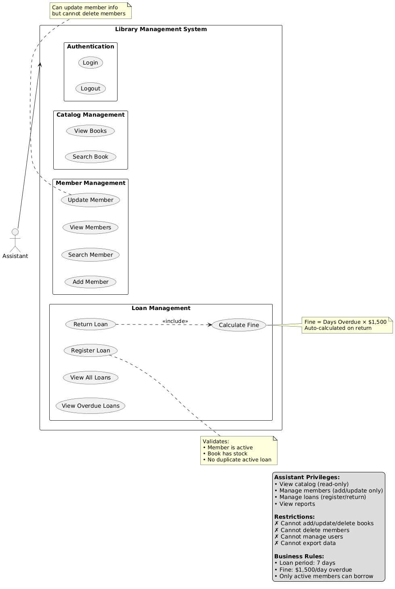

# 📚 Library Management System - LibroNova


A comprehensive library management system built with Java Swing, featuring loan tracking, inventory management, fine calculation, and export functionality.

**Repository:** https://github.com/Johan192004/book

---

## 📋 Table of Contents

- [System Overview](#-system-overview)
- [Features](#-features)
- [Prerequisites](#-prerequisites)
- [Installation & Setup](#-installation--setup)
- [Running the Application](#-running-the-application)
- [Usage Guide](#-usage-guide)
- [Testing](#-testing)
- [Project Structure](#-project-structure)
- [Diagrams](#-diagrams)
- [Screenshots](#-screenshots)
- [Error Handling](#️-error-handling)
- [Business Rules](#-business-rules)
- [Troubleshooting](#-troubleshooting)
- [License](#-license)
- [Author](#-author)
- [Acknowledgments](#-acknowledgments)

---

## 🎯 System Overview

**LibroNova** is a desktop-based library management system designed to streamline library operations. The system provides comprehensive features for managing books, members, loans, and generating reports. Built using Java Swing for the user interface and MySQL for data persistence, it follows a layered architecture pattern (MVC-inspired) with clear separation of concerns.

### Key Capabilities:
- **User Authentication**: Role-based access control (Admin/Assistant)
- **Catalog Management**: Complete CRUD operations for books
- **Member Management**: Register and manage library members
- **Loan System**: Track book borrowing with automatic due date calculation
- **Fine Calculation**: Automatic fine calculation for overdue books ($1,500 per day)
- **Export Functionality**: CSV export for catalog and overdue loans
- **Reporting**: Comprehensive reports for loans, overdues, and inventory

---

## ✨ Features

### 👥 User Management
- Two role types: **ADMIN** and **ASSISTANT**
- Role-based permissions and access control
- User registration and authentication
- Active/inactive user status

### 📖 Catalog Management
- Add, update, delete, and search books
- Book categorization (Fiction, Non-Fiction, Science, Technology, History, etc.)
- Stock management with availability tracking
- ISBN-based identification
- Price and quantity control

### 👤 Member Management
- Register new library members
- Manage member information (name, email, phone)
- Active/inactive member status
- Member search and update functionality

### 📅 Loan Management
- Register new book loans
- Automatic due date calculation (7 days from borrow date)
- Mark loans as returned
- Automatic fine calculation for overdue returns
- Loan status tracking (Borrowed, Returned, Overdue)
- Stock validation before loan registration

### 📊 Reports & Export
- View all loans (active and returned)
- Filter overdue loans
- Export catalog to CSV
- Export overdue loans to CSV
- Fine amount reporting

---

## 🔧 Prerequisites

Before running the application, ensure you have the following installed:

### 1. **Java Development Kit (JDK)**
- **Version**: JDK 21 or higher
- **Download**: [Oracle JDK](https://www.oracle.com/java/technologies/downloads/) or [OpenJDK](https://openjdk.org/)
- **Verify Installation**:
  ```bash
  java -version
  javac -version
  ```

### 2. **Apache Maven**
- **Version**: Maven 3.6+ (recommended 3.9+)
- **Download**: [Apache Maven](https://maven.apache.org/download.cgi)
- **Verify Installation**:
  ```bash
  mvn -version
  ```

### 3. **MySQL Database**
- **Version**: MySQL 8.0 or higher
- **Download**: [MySQL Community Server](https://dev.mysql.com/downloads/mysql/)
- **Alternative**: [MariaDB](https://mariadb.org/download/)
- **Verify Installation**:
  ```bash
  mysql --version
  ```

### 4. **Git** (Optional, for cloning)
- **Download**: [Git](https://git-scm.com/downloads)

---

## 🚀 Installation & Setup

### Step 1: Clone the Repository

```bash
git clone https://github.com/Johan192004/book.git
cd book
```

### Step 2: Configure Database Connection

Edit the file `src/main/resources/config.properties` with your database credentials:

```properties
# Database Configuration
db.url=jdbc:mysql://YOUR_HOST:YOUR_PORT/YOUR_DATABASE
db.user=your_database_user
db.password=your_database_password

# Application Settings
daysBorrowLimit=7
finePerDay=1500
```

**Examples:**

- **Local MySQL:**
  ```properties
  db.url=jdbc:mysql://localhost:3306/johanB
  db.user=root
  db.password=your_password
  ```

- **Remote/Cloud Database:**
  ```properties
  db.url=jdbc:mysql://168.119.183.3:3307/johanB
  db.user=root
  db.password=your_password
  ```

**Note:** Make sure your database already exists and has the schema created from `src/main/resources/DDL.sql`

### Step 3: Build the Project

```bash
# Clean and compile
mvn clean compile

# Package the application
mvn clean package
```

---

## ▶️ Running the Application

### Option 1: Using Maven

```bash
mvn exec:java -Dexec.mainClass="app.Main"
```

### Option 2: Using Java directly

```bash
# After packaging
java -cp target/libroNova-1.0-SNAPSHOT.jar app.Main
```

### Option 3: Using IDE
- Open the project in IntelliJ IDEA, Eclipse, or NetBeans
- Navigate to `src/main/java/app/Main.java`
- Right-click and select "Run Main.main()"

---

## 📖 Usage Guide

### Default Credentials

The system comes with two pre-configured users:

| Username   | Password   | Role      |
|------------|------------|-----------|
| admin      | admin123   | ADMIN     |
| assistant  | assist123  | ASSISTANT |

### Navigation Flow

1. **Login Screen**: Enter username and password
2. **Main Menu**: Select from available options based on your role
3. **Module Menus**: Navigate through specific functionality (Catalog, Members, Loans, Export)

### Permission Matrix

| Feature                  | ADMIN | ASSISTANT |
|--------------------------|-------|-----------|
| View Catalog             | ✅     | ✅         |
| Add/Update/Delete Books  | ✅     | ❌         |
| View Members             | ✅     | ✅         |
| Add/Update Members       | ✅     | ✅         |
| Delete Members           | ✅     | ❌         |
| Register Loans           | ✅     | ✅         |
| Mark Returns             | ✅     | ✅         |
| View Loans               | ✅     | ✅         |
| Export Data              | ✅     | ❌         |
| Register Users           | ✅     | ❌         |

---

## 🧪 Testing

The project includes unit tests for core business logic:

### Run All Tests

```bash
mvn test
```

### Run Specific Test Class

```bash
# Test fine calculation
mvn test -Dtest=LoanServiceTest

# Test catalog validation
mvn test -Dtest=CatalogServiceTest
```

### Test Coverage

- **LoanServiceTest**: Fine calculation logic
- **CatalogServiceTest**: Stock validation and ISBN validation


---

## 📁 Project Structure

```
book/
├── src/
│   ├── main/
│   │   ├── java/
│   │   │   ├── app/
│   │   │   │   └── Main.java              # Application entry point
│   │   │   ├── config/
│   │   │   │   ├── DatabaseConfig.java    # Database connection
│   │   │   │   └── PropertiesLoad.java    # Configuration loader
│   │   │   ├── controller/
│   │   │   │   ├── AuthController.java    # Authentication logic
│   │   │   │   ├── CatalogController.java # Book operations
│   │   │   │   ├── MemberController.java  # Member operations
│   │   │   │   ├── UserController.java    # User management
│   │   │   │   ├── LoanController.java    # Loan operations
│   │   │   │   └── ExportController.java  # Export functionality
│   │   │   ├── dao/
│   │   │   │   ├── CatalogDao.java
│   │   │   │   ├── MemberDao.java
│   │   │   │   ├── UserDao.java
│   │   │   │   ├── LoanDao.java
│   │   │   │   └── impl/                  # DAO implementations
│   │   │   ├── domain/
│   │   │   │   ├── Book.java              # Book entity
│   │   │   │   ├── Member.java            # Member entity
│   │   │   │   ├── User.java              # User entity
│   │   │   │   ├── Loan.java              # Loan entity
│   │   │   │   └── SessionContext.java    # Session management
│   │   │   ├── errors/
│   │   │   │   ├── BadRequestException.java
│   │   │   │   ├── ConflictException.java
│   │   │   │   ├── DataAccessException.java
│   │   │   │   ├── NotFoundException.java
│   │   │   │   ├── ServiceException.java
│   │   │   │   └── UnauthorizedException.java
│   │   │   ├── service/
│   │   │   │   ├── AuthService.java       # Authentication service
│   │   │   │   ├── CatalogService.java    # Catalog business logic
│   │   │   │   ├── MemberService.java     # Member business logic
│   │   │   │   ├── UserService.java       # User business logic
│   │   │   │   ├── LoanService.java       # Loan business logic
│   │   │   │   └── ExportService.java     # Export business logic
│   │   │   ├── util/
│   │   │   │   ├── Logger.java            # Logging utility
│   │   │   │   ├── Message.java           # Message dialogs
│   │   │   │   └── TableFormatter.java    # Table formatting
│   │   │   └── view/
│   │   │       ├── MainView.java          # Main menu
│   │   │       ├── CatalogView.java       # Catalog UI
│   │   │       ├── MemberView.java        # Member UI
│   │   │       ├── UserView.java          # User UI
│   │   │       ├── LoanView.java          # Loan UI
│   │   │       └── ExportView.java        # Export UI
│   │   └── resources/
│   │       ├── config.properties          # Configuration file
│   │       └── DDL.sql                    # Database schema
│   └── test/
│       └── java/
│           └── service/
│               ├── LoanServiceTest.java   # Loan tests
│               └── CatalogServiceTest.java # Catalog tests
├── pom.xml                                # Maven configuration
└── README.md                              # This file
```

### Architecture Layers

1. **View Layer**: Java Swing UI components (JOptionPane-based)
2. **Controller Layer**: Request handling and validation
3. **Service Layer**: Business logic implementation
4. **DAO Layer**: Data access and database operations
5. **Domain Layer**: Entity models and enums
6. **Utility Layer**: Helper classes and utilities

---

## 📊 Diagrams

### Class Diagram

The following diagram shows the domain model of the library management system, including all entities, their attributes, relationships, and enumerations.



**Key entities:**
- **Book**: Catalog items with ISBN, category, stock management
- **Member**: Library members who can borrow books
- **User**: System users (Admin/Assistant) with role-based access
- **Loan**: Represents book borrowing transactions with fine calculation
- **SessionContext**: Manages current user session

### Use Case Diagrams

#### Admin Use Cases

The Admin role has full access to all system features including user management, data export, and complete CRUD operations.



**Admin capabilities:**
- Full catalog management (add, update, delete books)
- Complete member management (including delete)
- User management (register, update, delete users)
- Loan management (register, return, view)
- Export functionality (catalog and overdue loans to CSV)

#### Assistant Use Cases

The Assistant role has limited access focused on day-to-day library operations without administrative privileges.



**Assistant capabilities:**
- View catalog (read-only)
- Member management (add and update, but cannot delete)
- Loan management (register, return, view)
- View reports and overdue loans

**Restrictions:**
- Cannot modify catalog (books)
- Cannot delete members
- Cannot manage users
- Cannot export data

---

## 📸 Screenshots

### 1. Login Screen
The authentication interface where users enter credentials. Only active users can login successfully.


### 2. Admin Main Menu
Role-based main menu showing available options for authenticated users.


### 3. Admin Catalog View
Book catalog interface with search and management options (Admin only for modifications).


### 4. Assistant Main Menu
Member management interface showing list and action options.


### 5. Assistant Catalog View
Book catalog interface with search and management options 


---

## 🛡️ Error Handling

The system implements comprehensive error handling:

- **BadRequestException**: Invalid input or request
- **ConflictException**: Duplicate entries (ISBN, email, phone)
- **NotFoundException**: Resource not found
- **UnauthorizedException**: Insufficient permissions
- **DataAccessException**: Database operation errors
- **ServiceException**: Business logic errors

All errors are displayed to users via JOptionPane dialogs with clear messages.

---

## 📝 Business Rules

1. **Loan Period**: 7 days from borrow date
2. **Fine Rate**: $1,500 per day for overdue books
3. **Stock Management**: Books can only be loaned if available stock > 0
4. **ISBN Uniqueness**: Each book must have a unique ISBN
5. **Member Validation**: Only active members can borrow books
6. **Return Processing**: Automatic fine calculation upon return
7. **Export Access**: Only ADMIN users can export data

---

## 🚧 Troubleshooting

### Database Connection Issues

```bash
# Check MySQL is running
sudo service mysql status

# Test connection
mysql -u root -p -h localhost -P 3306
```

### Build Failures

```bash
# Clean Maven cache
mvn clean

# Force update dependencies
mvn clean install -U
```

### Runtime Errors

- Verify `config.properties` has correct database credentials
- Ensure MySQL database `johanB` exists
- Check that DDL.sql has been executed
- Verify Java 21 is being used: `java -version`

---


## 📄 License

This project is licensed under the MIT License - see the [LICENSE](LICENSE) file for details.

---

## 👨‍💻 Author

**Johan**
- **Name:** Johan Ramirez Marin
- **Clan:** Berners Lee
- **Email:** johanruma@gmail.com
- **Document ID:** C.C 1023624863
- GitHub: [@Johan192004](https://github.com/Johan192004)